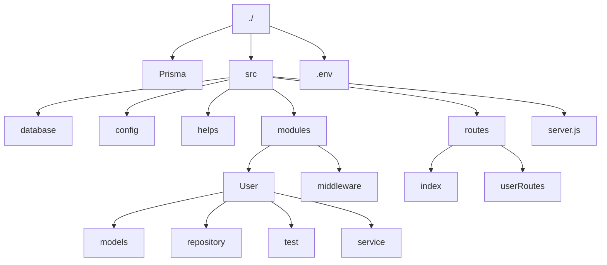
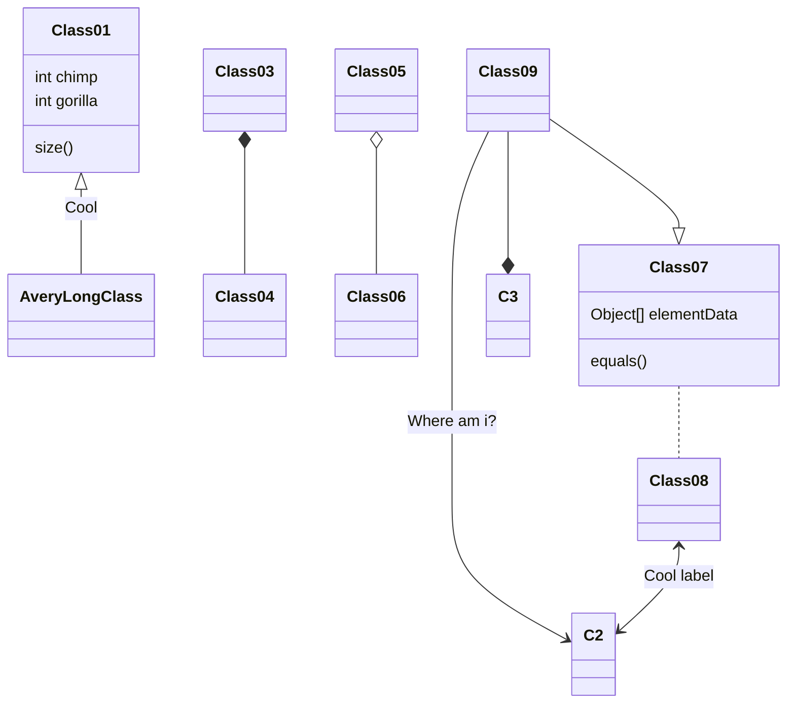

# API USER

## Dados Usuário
- nome
- imagem
- email
- senha
- endereço chave estrangeira
## Dados Endereço
- cep
- logradouro
- complemento
- bairro
- localidade
- uf

## Dados post
- id_post
- descricao

## Dados Usuários post 
- id_usuario
- id_post

## Iniciando o projeto
- npm init

### Dependências

- **Adicionar ao projeto .gitignore**

### Importante

## Estrutura do Projeto
```
- src
    - modulos
        - Entidades
            - middleware
            - models
                - EntidadeModel.js
            - useCase
                - EntidadeController.js
                - EntidadeUseCase.js
        - infra
            - ConexaoBanco
    - routes
        - index.ts
        - entidadeRoutes.ts
    - server.ts
```

## Prisma ORM
- npm install prisma --save-dev
- npx prisma init
- Extersões VS Code
    - Prisma
    - Prisma Insider
- npx prisma format
- npx prisma migrate dev --name init
    - Cria a migration
    - Roda comando SQL

## Dependência
- npm i module-alias
- npm i dotenv

## 


##



### Comandos Prisma
- npx prisma migrate dev --name create_new_fields
- npx prisma migrate dev

### Observações
#### Decryptar parte do token jwt
```
var t = token.split('.')[1]
const buffer = Buffer.from(t, 'base64').toString()
var b = JSON.parse(buffer)
```

## Referências
- https://www.typescriptlang.org/
- https://www.toptal.com/developers/gitignore
- https://mermaid-js.github.io/mermaid/#/
- https://www.prisma.io/docs/getting-started/setup-prisma/start-from-scratch/relational-databases/install-prisma-client-node-postgres
- https://www.prisma.io/docs/getting-started/setup-prisma/start-from-scratch/relational-databases/querying-the-database-node-postgres
